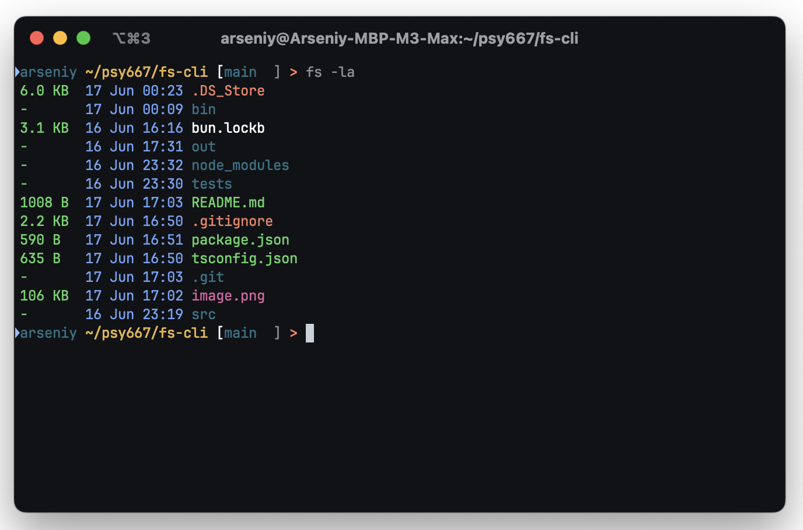

# fs - A Simple ls Alternative
fs is a command-line interface (CLI) application designed to list directory contents in a simple and user-friendly manner. 

Written in Node.js with no external dependencies

## Features
- Support for displaying all files including hidden ones.
- Color-coded output for easier readability (optional).
- Display of detailed information about files and directories.
- Filters to show only directories or only files.

## Usage
```shell
fs [options]
```   
Options:
- `-h`, `--help`: Display help information.
- `-a`, `--all`: Show all files, including hidden files.
- `-c`, `--no-colors`: Disable colored output.
- `-l`, `--detailed`: Show detailed information about files and directories.
- `-d`, `--only-dirs`: Show only directories.
- `-f`, `--only-files`: Show only files.
- `-v`, `--version`: Display the current version of the fs application.

## Example Usages

Display all files including hidden ones with detailed information:

```shell
fs -la
```

